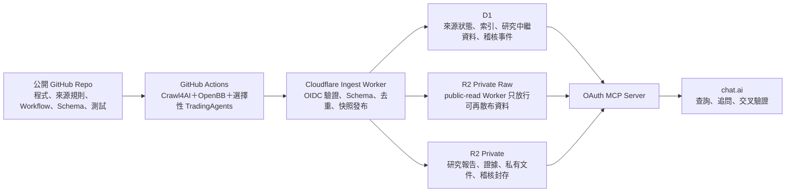

# CF＋GitHub＋MCP 財經資料平台實作計畫

更新日期：2026-08-10  
狀態：資料契約、Ingest Worker、D1／R2 與 15 來源議題雷達已在隔離驗證帳號完成單次 GitHub OIDC 垂直切片；正式排程、長期穩定性、外部告警與故障恢復尚未驗收。

本計畫延續 [120 家新聞品牌的按需資源架構](./resource-aware-news-architecture.md)，並採用 SB 筆記中已確認的 GitHub Actions 失效策略：[GitHub Actions 爬蟲與 CF MCP 架構](https://github.com/AlanChen75/knowledge-base/blob/main/tech/devops/2026-08-06-GitHub-Actions-%E7%88%AC%E8%9F%B2%E8%88%87-CF-MCP-%E6%9E%B6%E6%A7%8B.md)。

## 一、已確認的架構決策

- GitHub Actions 是可失敗、可重跑、可被替換的批次算力，不是資料真實來源。
- Cloudflare D1＋R2 是 system of record；Actions 中斷只能影響新鮮度，不得讓既有 MCP 查詢失效。
- Worker 依權限拆成公開 Relay、只寫 Ingest 與授權讀取 MCP；GitHub Actions 不持有廣泛的 D1／R2 管理權限。
- Crawl4AI、OpenBB 與 TradingAgents 均以背景批次執行，不要求即時 Python 後端。
- chat.ai 透過 MCP 讀取已整理的資料，負責後續追問與即時推理。
- 免費額度優先；Workers Paid、Container、商業 proxy／web unlocker 與雙雲高可用都不是第一階段必要條件。OpenBB provider 與 TradingAgents 模型費用另設獨立 budget gate，不併入 GitHub／Cloudflare 免費額度宣稱。
- 爬取維持 Browser＋API＋RSS 分層，並按來源、資源與失敗類型選擇執行平台。

## 二、目標資料流

大型原文與報告放 R2，D1 只保存結構化狀態、索引、關聯與版本資訊。第一版以單一 operational D1 保持 checkpoint、snapshot 與發布索引在同一交易邊界；權限由不同 Worker 與 MCP scope 隔離，而非先拆成無法跨庫交易的多個 D1。Vectorize 延後到 D1 FTS 被證明不足時再導入。

## 三、資料與權限分離

| 資料類型 | 建議位置 | 公開程度 | 主要內容 |
|---|---|---:|---|
| 程式與來源定義 | GitHub public repo | 公開 | Workflow、來源 manifest、schema、測試、非敏感樣本與摘要 |
| 來源目錄 | operational D1 `source_catalog` | MCP 依 scope | 來源、分類、授權、路由、抓取策略與健康狀態 |
| 一般原始資料 | private R2 `raw-objects` | public-read Worker 只放行可再散布項目 | 正規化前後的公開資料、物件 hash、擷取時間 |
| 研究索引 | operational D1 `research_index` | 私有 MCP | 議題、證據關聯、快照、OpenBB 市場資料索引 |
| 分析報告 | R2 `research-reports` | 私有 MCP | 熱門議題、多空論證、背離與風險第二意見 |
| 私有證據與文件 | R2 `private-evidence` | 嚴格私有 MCP | 不可公開內容、完整研究附件與授權資料 |
| 稽核紀錄 | operational D1 `audit_events`＋private R2 `audit-archive` | 稽核 scope | append-only 事件、hash chain、每日封存 |

原始資料不應大量提交進 Git history。只有授權清楚的小型 fixture、manifest、hash 與可公開樣本能留在 repository；完整 raw data 優先放 R2。

## 四、背景分析管線

1. Crawl4AI 依來源策略執行 RSS、API、HTTP 或 Browser 擷取。
2. OpenBB 整理市場資料、標的與時間軸，產生可比對的市場快照。
3. 議題雷達計算熱度、成長率、來源廣度、新聞／社群背離與資料可信度。
4. 只有以下工作會啟動 TradingAgents：
   - 當期熱門議題前三名；
   - 重大新聞／社群背離；
   - 使用者或研究任務明確指定的題目。
5. Worker 驗證 schema、證據引用、hash 與最低覆蓋率後，才將 staging snapshot 切換成 current snapshot。

每個 run 必須保存以下階段狀態，下一輪只補缺少的階段：

- `raw_collected`
- `openbb_normalized`
- `topic_scored`
- `tradingagents_completed`（未達啟動條件時記錄 `skipped` 與原因）
- `published`

TradingAgents 產出一律標示為模型生成的「第二意見」，至少包含 bull case、bear case、risk view、evidence IDs、模型／agent 版本、`generated_at`、confidence 與 `expires_at`，不得表示為交易事實或最終投資結論。

## 五、GitHub 到 Cloudflare 的寫入邊界

優先採 GitHub OIDC 呼叫 ingest Worker。Worker 驗證 repository、ref、workflow、commit SHA 與 workflow run ID，並只接受已註冊 schema 的 payload。

- GitHub Actions 不取得廣泛 D1／R2 token。
- 大型物件由 Worker 以只存在 Worker Secret 的 R2 S3 簽章憑證，發放短效、單一物件、限定 HTTP method 與 content type 的 presigned URL；URL 本身視為 bearer token，不得寫入 log。
- 若第一版尚未完成 OIDC，只能暫用窄權限、write-only、可輪替的 ingest token。
- 所有輸出先進 staging；驗證完成才更新 `current_snapshot_id`。
- token、cookie、私有來源內容、完整私有結果不得進入 GitHub log、artifact 或 repository。

每筆稽核事件至少包含：`run_id`、repository、workflow ref、commit SHA、workflow run ID、source manifest hash、input snapshot、output manifest hash、status、`previous_event_hash` 與 `event_hash`。

## 六、GitHub Actions 失效與恢復

本段直接採用既有 SB 策略，不另建即時 heartbeat 或雙雲排程系統。

### Checkpoint

D1 對每個來源保存 `last_discovered_at`、`last_successful_crawl`、`last_article_date`、cursor、stage status 與 last-good snapshot。Checkpoint 只在該階段驗證成功後前進。

### Idempotency

至少以 `source_id＋canonical_url＋content_hash` 去重。相同 workflow 或相同 payload 重放，不得新增重複文章、報告或稽核業務事件。

### Catch-up crawling

下一次 Action 從最後成功 checkpoint 接續，並以來源的時間窗或 cursor 補抓中斷區間。單頁暫時性失敗最多重試 2–3 次；runner 或 workflow 基礎設施失敗則結束本輪，交給後續排程補跑。

### Staleness watchdog

Cloudflare 端以目前時間減去 `last_successful_crawl` 判斷 freshness。預設高頻來源可採 `<6h` healthy、`6–24h` warning、`>24h` stale；實際門檻必須依來源頻率配置。MCP 回應必須揭露 `as_of`、snapshot ID、freshness、partial 狀態與失敗來源。

### 告警與替代路徑

- 正式啟用 schedule 前，必須完成外部失敗通知與「資料超過 N 小時未更新」的反向健康檢查；GitHub Actions 頁面本身不算告警。
- Browser Run 不是 GitHub Actions 故障時的全面備援，只用於即時／按需、互動式、長期不穩定或需立即驗證的少數來源。
- timeout、runner unavailable、資源不足等可重試技術失敗，才能排除已嘗試 executor 後重新路由。
- `robots_denied`、`auth_required`、paywall 是終止狀態，不切換 IP、browser 或 unlocker 規避。
- 商業 executor、residential proxy 或 web unlocker 只有在明確授權與成本預算開啟後才能使用。

## 七、MCP 介面

OAuth scope 預計分為：

- `sources:read`
- `raw:read`
- `research:read`
- `evidence:read`
- `audit:read`
- `refresh:write`（選配）
- `admin`

第一階段 MCP tools：

- `search_topics`
- `get_topic_evidence`
- `compare_news_social`
- `get_market_snapshot`
- `get_research_report`
- `get_source_status`
- `request_refresh`
- `get_job_status`

公開介面不得取得研究報告、私有證據、稽核明細或私有文件；完整資料只經過授權 MCP scope 存取。

## 八、分階段里程碑

| 階段 | 狀態 | 交付與驗證 |
|---|---|---|
| 0. 來源與路由 POC | 部分完成 | 已完成來源矩陣、120 品牌單一 GitHub executor 擴大樣本與 15 來源垂直切片；跨時間 observation state 與同 URL 多 executor A/B 待辦 |
| 1. 資料契約 | 本機完成 | 七份 version 1 JSON Schema、嚴格邊界驗證、content-based item ID 與版本策略已通過測試 |
| 2. CF system of record | 遠端垂直切片完成 | APAC D1 migration、private R2 binding、staging／current、last-good、稽核 hash chain 與 Ingest Worker 已部署；run `31369726174` 寫入 38 items 與 1 個 current snapshot，並直讀 R2 object 驗證 hash |
| 3. GH 批次管線 | 手動 OIDC 實接完成 | ingest envelope、immutable repo／owner／workflow／ref claims、commit SHA／workflow run 綁定、checkpoint 與單次 staging→publish 已實辦；遠端重放、catch-up、真正外部告警與 staleness 待辦 |
| 4. 議題雷達與研究 | 遠端垂直切片完成 | 15 個唯一來源、熱門前三名、新聞／社群背離與 partial 揭露已由 GitHub-hosted runner 實測；OpenBB 正規化與選擇性 TradingAgents 待辦 |
| 5. OAuth MCP | 待辦 | scope、查詢 tools、freshness／partial 揭露、公開與私有權限測試 |
| 6. 穩定性驗收 | 待辦 | 故障注入、額度觀測、連續一週正常排程與補跑紀錄 |

不以「已送出 workflow」視為完成。每一階段必須有可重現測試、實際輸出或 health response 才能改成已完成。

### 2026-08-10 議題雷達垂直切片

本機以 `radar-sources.yaml` 執行 15 個不重複來源，不把同一來源的不同路徑重複計數，也未觸發 GitHub Actions。驗收門檻是至少 12 個來源成功且產出三個可溯源議題。

| 路徑 | 成功／總數 | 結果 |
|---|---:|---|
| RSS | 5/5 | Fed、ECB、BBC Business、CNBC、MarketWatch |
| Public API | 7/7 | Hacker News、Money／Quant Stack Exchange、CoinGecko、World Bank、OpenBB／TradingAgents GitHub Issues |
| Browser＋Crawl4AI | 2/3 | OpenBB Discussions、TradingView Ideas 成功；Bogleheads 回傳 Cloudflare JS challenge／HTTP 403 |
| 合計 | 14/15 | 38 筆 raw items、三個 topic、snapshot `partial=true`、驗收通過 |

當次前三名為 equities／earnings（社群領先）、AI／semiconductors（新聞領先）與 personal finance（社群領先）。這只是該次資料的可重現規則式雷達結果，不是投資結論，也不外推為長期來源成功率。完整 raw 與 ingest payload 僅保存在本機暫存目錄，未提交 public repo；程式內 fixture 都明確標為 synthetic。

### 2026-08-10 GitHub OIDC → Cloudflare 遠端實接

[Actions run 31369726174](https://github.com/ai-cooperation/finance-crawler-validation/actions/runs/31369726174) 從 commit `64d78dfbda9eae9876a266085d64853ba6e510a7` 執行一次手動垂直切片，耗時 1 分 52 秒。GitHub-hosted runner 實際取得 OIDC，通過 `finance-crawler-validation-ingest` 寫入 APAC D1 `476bd84f-e924-4b9b-a9d9-dfca9ea29a1a` 與 private R2 `finance-crawler-validation-raw`。

- 來源：14/15 成功，RSS 5/5、Public API 7/7、Browser 2/3。
- 產物：38 個 raw items、3 個 topics、snapshot `radar_20260810t082255z`，因 Bogleheads Browser 失敗而 `partial=true`。
- D1：`runs.status=published`，`raw_items=38`，`run_items=38`，`topic_snapshots=1`，`current_snapshot` 指向當次 snapshot；`raw_collected` 與 `published` audit events 各 1 筆。
- R2：直接讀回 topic JSON（4,085 bytes）與一個 raw JSON（66,104 bytes）；topic SHA-256 `4aff9ea563bf190ab4bee9bd9e187b92b9cbbd7f5a118c138d0f358978fc7093` 與 D1 完全一致。R2 bucket usage 彙總當時仍顯示 0，因此驗收以直接 object get 為準，不以延遲的彙總指標推定。
- 公開 artifact 只有 source-health `run-report.json`；raw items 與 topic snapshot 沒有上傳為 GitHub artifact。

進入 OpenBB 前仍須完成：遠端重放去重、故障注入確認 last-good、catch-up 視窗、外部失敗通知與 staleness watchdog。正式 schedule 仍保持關閉。

## 九、驗收條件

- 任一分析階段中斷時，`current_snapshot_id` 保持 last-good，不發布半成品。
- 下一次執行能從 checkpoint 補齊中斷區間，不必整批重跑。
- 相同 payload、workflow run 或文章重放時不產生重複資料。
- Actions 停止期間，MCP 仍可查詢舊快照並明確顯示 stale。
- GitHub Actions 無法讀取 private evidence、private reports、audit archive 或私有文件。
- 公開端點無法越權取得研究、稽核與私有資料。
- GitHub log、artifact 與 repository 不包含 secret 或私有內容。
- 外部通知可收到人工注入的 workflow 失敗與資料過期告警。
- 一週 soak test 期間記錄實際 GitHub Actions、Workers、D1、R2 用量；是否位於免費額度內以觀測值判定，不以估算宣稱。

## 十、目前不做

- 即時交易、下單或自動投資決策。
- 為即時 OpenBB／TradingAgents 預先升級 Workers Paid 或 Container。
- 全來源一律使用 proxy、residential browser 或 web unlocker。
- GitHub Actions 的雙雲熱備與即時 heartbeat 狀態機。
- 未取得授權的全文鏡像或繞過 robots、登入與付費牆。
