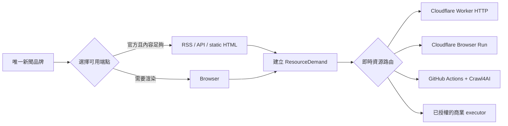

# 120 家新聞品牌的按需資源架構

本文件定義來源層與執行器路由；資料保存、分析、權限與 GitHub Actions 失效恢復的下一階段實作，見 [CF＋GitHub＋MCP 財經資料平台實作計畫](./cf-gh-mcp-implementation-plan.md)。

## 結論

新聞來源的新版分母固定為 **120 個不重複品牌／機構**：100 個財經專業媒體，加上 20 個綜合媒體的財經新聞部門。RSS、API、靜態 HTML、Browser 是同一品牌的取得端點，不是額外來源。

執行平台不按 transport 固定分工。每一個抓取工作先描述能力與資源需求，再依當下可用性、配額、憑證與成本選擇符合條件的最低成本執行器。Cloudflare 與 GitHub Actions 都是可替換的 executor，不是某一類來源的永久 owner。

`news-sources.yaml` 現在是完整的 120/120 品牌 catalog：100 個財經專業媒體、20 個綜合媒體財經部門。2026-08-13 P2 驗收時共有 162 個巢狀 endpoints；endpoint 數可以因合規 fallback 成長，但品牌分母固定為 120。每個品牌的 canonical domain 唯一；既有 52 或 86 條舊實驗路徑沒有被改名後灌入分母。

## 兩層決策

第一層選 endpoint，原則是用能滿足資料品質與時效的最小能力：

1. 優先評估官方 RSS、API 或靜態 HTML；兩者都有時，依欄位完整度與更新時效選擇，不為了追求單一 transport 強制改路徑。
2. 機器介面缺資料或頁面需要 JavaScript 時，才建立 Browser demand。
3. 同一品牌只要任一合規 endpoint 通過內容驗證，就計為該品牌本次成功；endpoint 成功率另行報告。

第二層選 executor。`ResourceDemand` 包含：

- 必要能力，例如 `http`、`rss`、`javascript`、`chromium`、`python`、`crawl4ai`、`residential_egress`；
- 預估最長執行秒數與回應大小；
- 可選的最高成本等級。

`ExecutorState` 是調度當下的狀態：是否可用、是否有合法憑證、剩餘工作額度。路由器只會選擇能力足夠、資源上限容納工作、仍有額度且成本最低的 executor。`resource-executors.yaml` 中的秒數與 bytes 是本 repository 的 admission policy，不是宣稱供應商的絕對產品上限。

## 目前 executor 梯度

| Executor | 可表達能力 | 典型適用需求 | 啟用條件 |
|---|---|---|---|
| Cloudflare Worker HTTP | HTTP、JSON、RSS、靜態 HTML | 短任務、小回應、無 Browser | 當下有配額 |
| Cloudflare Browser Run | JavaScript、Chromium | 短時間渲染 | 當下有 Browser 容量 |
| GitHub Actions + Crawl4AI | Python、Crawl4AI、Chromium | 較長處理、Python extraction、可重現實驗 | runner 可用且工作符合 policy cap |
| Firecrawl Hosted | Chromium、web unlocker | 已核准的商業 unlocker 實驗 | 有憑證與核准預算 |
| Browserless Residential | Chromium、residential egress | 已核准的 residential A/B | 有憑證與核准預算 |

這張表只是能力 catalog。實際選擇由 demand 和 state 決定：短 Browser 工作若 Cloudflare 沒額度，可以落到 GitHub；需要 Python 的工作即使來源是 RSS，也可以直接選 GitHub；要求 residential egress 的工作在沒有商業憑證時必須明確 blocked。

## 升級與停止規則

可重試的技術結果，例如 timeout、runner unavailable、資源不足，可以把已嘗試 executor 排除後重新路由。下列結果是合規終點，不可藉換 IP、換 Browser 或商業 unlocker 繼續升級：

- `robots_denied`
- `auth_required`
- `paywall`

商業 executor 不是預設 fallback。只有 demand 明確需要相應能力、憑證存在、配額可用且成本等級未超出工作上限時，才會成為候選。

## 成功率與穩定性分母

新聞品牌成功率只使用唯一品牌計算：

- 90% = 108/120 個品牌成功；
- 95% = 114/120 個品牌成功；
- 同品牌的 RSS、API、Browser 全成功，分子仍只加一；
- 監管機關、交易所、公司 IR 與國外社群另建 catalog，不併入這 120 家新聞品牌。

「穩定成功」要求三個相互獨立、跨時間的 production observation 都成功。它不是在同一個 GitHub Actions job 內重抓三次，也不要求每次驗證都把 120 家全部重跑。觀察紀錄應由正常按需抓取累積；新來源、近期失敗、端點變更或證據過期者才優先重驗。這樣三次觀察是時間穩定度證據，不是固定三倍 runner 成本。

## 舊實驗與遷移邊界

`sources.yaml` 和 `foreign-community-sources.yaml` 保留為既有能力實驗與證據，不是新版 120 家新聞品牌分母。舊報表中的 `source_id` 仍代表一條路徑，因此不得直接拿舊路徑數與新版品牌成功率互比。

遷移順序如下：

1. 已完成：品牌／endpoint schema、120＝100+20 契約、120 個不重複品牌 catalog、資源路由器與 executor catalog。
2. 已完成：品牌級 endpoint fallback、實際 probe、executor 證據與 `news-report.json`；手動 workflow scope 是 `news_120`。
3. 已完成：GitHub Actions 第一個 120 品牌 observation；同一輪沒有重複三次。
4. 待執行：把後續正常抓取寫入跨時間 observation state；只有近期失敗或變更者優先重驗。
5. 待執行：依失敗群組啟動同 URL、同判定規則的 Cloudflare／商業 executor A/B；未配置能力或憑證時維持 blocked，而不是推估成功率。

後續重驗改用 explicit brand batch：workflow 必須提供唯一 `brand_ids`，預設單批上限 30，artifact retention 為 7 天。子集報表保留 `target_brands=120` 與本批品牌清單，不能把 batch 內成功率冒充整體品牌成功率。RSS 路徑除了 HTTP、字數與財經語意外，還必須通過 XML root 契約；重導到 HTML 的 feed URL不再算成功。

## 2026-08-09 第一輪嚴格實測

[GitHub Actions run 31309377786](https://github.com/AlanChen75/finance-crawler-poc/actions/runs/31309377786) 在 commit `ff2c46a` 完成單輪 120 品牌實測。這一輪先將 static HTML 轉成可見文字，排除 script、style、template 與 noscript，再要求至少 300 字且命中任一財經語意詞；Browser 使用 Crawl4AI markdown，RSS 與 JSON 保留機器格式驗證。報表只保存 preview、SHA-256、final URL 與 content type，不保存完整正文。

| 指標 | 結果 |
|---|---:|
| 唯一品牌結果 | 120/120 有紀錄 |
| 品牌成功 | 99/120（82.5%） |
| 財經專業媒體 | 79/100（79%） |
| 綜合媒體財經部門 | 20/20（100%） |
| Endpoint attempts | 141 |
| Endpoint fallback 救回 | 17 個品牌 |
| RSS 成功 | 32 |
| JSON API 成功 | 2 |
| Static HTML 成功 | 49 |
| Browser 成功 | 16/25；排除 3 個 robots 終點後為 16/22（72.7%） |

21 個品牌未成功：15 個 blocked、3 個 invalid content、3 個 robots denied。90% 門檻需要 108 家，這一輪還差 9 家；95% 門檻需要 114 家，還差 15 家。這輪 runtime state 只開放 `github_actions_crawl4ai`，所以 141 次 endpoint attempt 全由 GitHub executor 執行；Cloudflare Browser Run、Firecrawl Hosted 與 Browserless Residential 沒有被假裝成已測。

機器可讀摘要保存在 `experiments/news-120/run-31309377786-summary.json`；完整 Action artifact 的 `news-report.json` SHA-256 是 `5e991ab2c3ee406689826ec6213ce1ff1e5ef128997992eaea6f0f325154ab19`。

## 2026-08-13 隔離帳號 baseline

[GitHub Actions run 31677822771](https://github.com/ai-cooperation/finance-crawler-validation/actions/runs/31677822771) 在 `ai-cooperation` public repo 完成 120/120 品牌單輪 observation，耗時 3 分 40 秒。這輪仍使用修改前的 148 endpoint catalog；101/120 品牌成功（84.17%），141 次 endpoint attempts，完整報表 SHA-256 為 `077f95616657fb1c9d3f38c9a3b07cbf57ab7dcc2fa3830d1904388977679cf4`。

19 個失敗為 14 blocked、1 HTTP error、1 invalid content 與 3 robots denied。Reuters、WSJ 網頁與 Barron's 的 robots denial 保留為合規終點；WSJ 另有公開品牌 RSS，將作為不同發布介面的獨立 endpoint 驗證，不以 Browser 規避網頁 robots。隔離帳號 baseline 與增量 batch 的完整契約見 [P2 120 品牌 observation 契約](./p2-news-observation-contract.md)。
